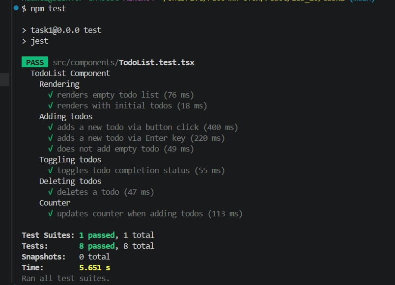

# Lab 10 – Task 1 (Testing React App)

##  Описание
В данном задании реализован React-приложение со списком задач (Todo List) и написаны автотесты с использованием Jest и Testing Library.

## ⚙️ Технологии
- React
- TypeScript
- Vite
- Jest
- @testing-library/react
- @testing-library/user-event

## Установка и запуск

```bash
npm install
npm run dev

Запуск тестов
npm test

Что реализовано
	•	Отображение списка задач
	•	Добавление новой задачи
	•	Добавление через кнопку и Enter
	•	Запрет добавления пустой задачи
	•	Переключение статуса (completed)
	•	Удаление задачи
	•	Счетчик задач

 Покрытие тестами
	•	Рендеринг
	•	Добавление задач
	•	Переключение статуса
	•	Удаление
	•	Обновление счетчика
  