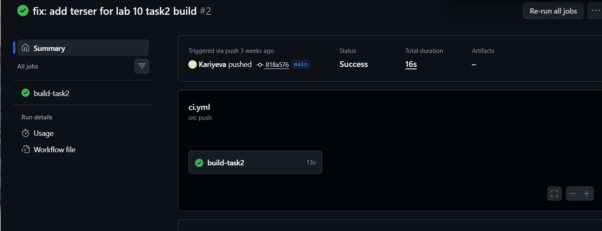

# Lab 10 – Task 2 (Build Optimization & CI)

##  Описание
Во втором задании настроена сборка проекта и CI (GitHub Actions) для автоматической проверки при push.

##  Технологии
- React
- TypeScript
- Vite
- GitHub Actions

##  Запуск проекта

```bash
npm install
npm run dev

Сборка проекта
npm run build
Оптимизация
	•	Используется Vite для быстрой сборки
	•	Разделение кода (manualChunks)
	•	Минификация через terser
	•	Исключены лишние файлы через .gitignore

 CI (GitHub Actions)

При каждом push:
	•	Устанавливаются зависимости
	•	Выполняется сборка проекта
	•	Проверяется корректность проекта

Файл конфигурации:
.github/workflows/ci.yml
Что реализовано
	•	Настроена production сборка
	•	Настроен CI pipeline
	•	Исправлены ошибки сборки (terser)
	•	Оптимизирован проект
    ## 📸 CI Result

